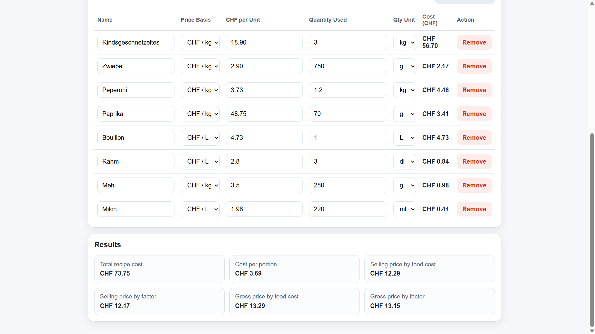
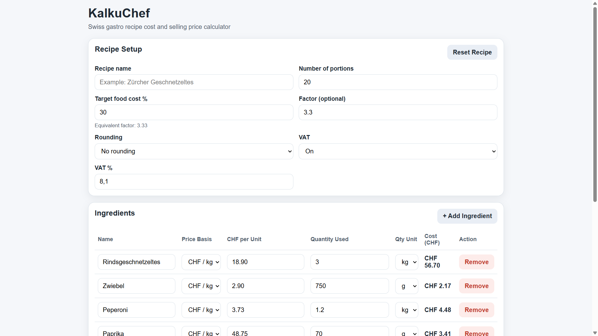
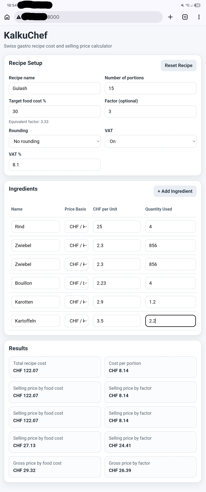
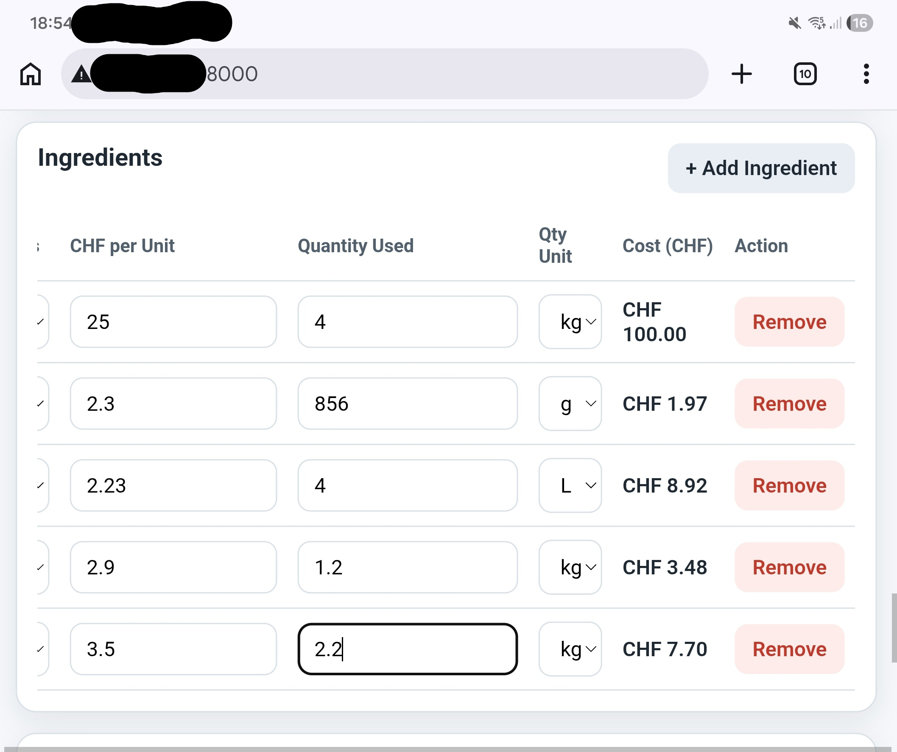

# KalkuChef

KalkuChef is a small responsive web app for calculating recipe cost and suggested selling price for gastro use.

It was built as a beginner front-end portfolio project with a practical real-world purpose: helping calculate recipe costs, cost per portion, and selling prices in a simple and professional way.

## Features

- Add and remove ingredient rows
- Enter ingredient name, unit price, and quantity used
- Support for:
  - CHF per kg with quantity in g or kg
  - CHF per L with quantity in ml, dl, or L
- Automatic unit conversion based on selected units
- Calculate total recipe cost
- Calculate cost per portion
- Suggest selling price based on target food cost percentage
- Suggest selling price based on factor
- Display equivalent factor from food cost %
- Optional rounding rules
- Optional VAT calculation
- Reset recipe button
- Responsive layout for mobile and desktop

## Tech Stack

- HTML
- CSS
- JavaScript

## Project Goal

This project was built to:

- practice front-end fundamentals
- build a useful small product for real kitchen work
- create a clean beginner portfolio project for GitHub

## How It Works

For each ingredient, the user enters:

- ingredient name
- unit type
- unit price in CHF per kg or CHF per L
- quantity used in the recipe

The app then calculates:

- total recipe cost
- cost per portion
- suggested selling price by food cost percentage
- suggested selling price by factor
- optional gross prices with VAT

## Screenshots

KalkuChef is designed to be simple and usable both on desktop and mobile devices.

### Desktop

Main view with recipe setup and results:

Detailed view of ingredient input:

### Mobile

Responsive layout overview:

Ingredient input detail on mobile:

## How to Run

1. Clone or download the repository
2. Open `index.html` in your browser

### Optional (recommended)

Run a local server for better module support:
python -m http.server 8000
Then open:
http://localhost:8000
Or on mobile (same Wi-Fi):
http://YOUR-IP:8000

No installation is required.

## Future Improvements

Possible future versions may include:

- recipe saving
- local storage
- labor cost calculation
- import from text
- import from image
- better kitchen rounding rules
- export or print layout
- Improve mobile layout (ingredient cards instead of table)

## Author

Built by Alfonso Gomez-Jordana as a practical front-end learning project.